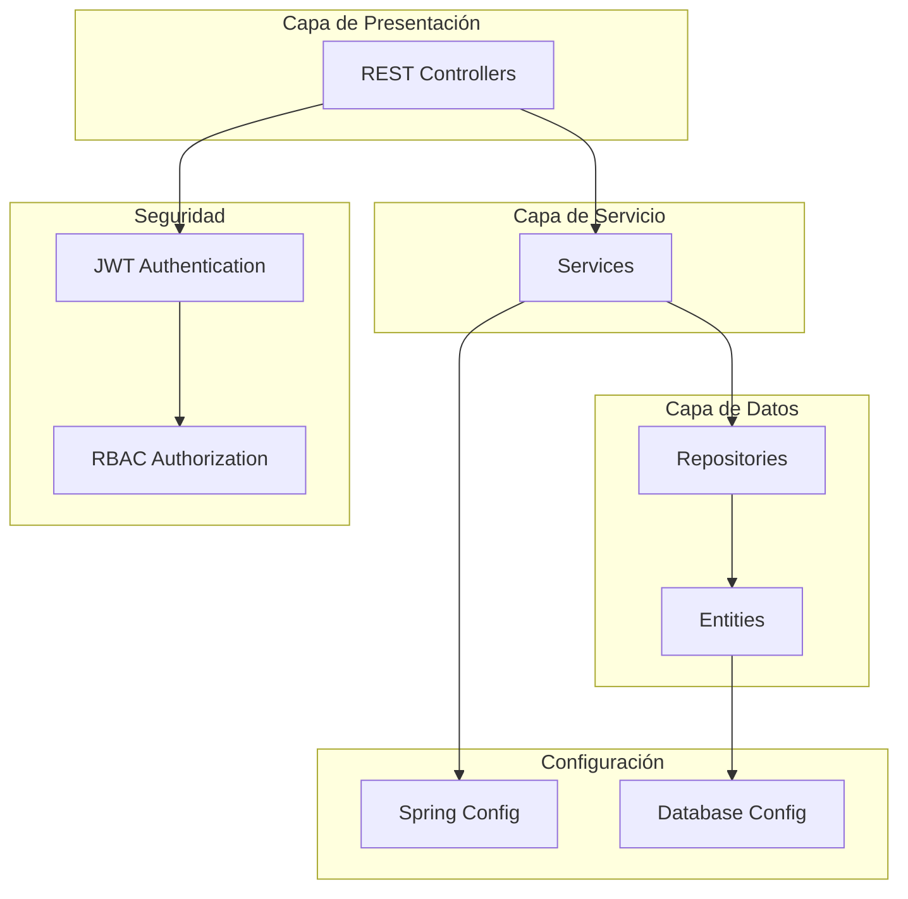

# Plan de Arquitectura del Sistema de Gestión de Restaurante

## Contexto del Proyecto
Aplicación empresarial para digitalizar operaciones de restaurante con arquitectura de microservicios REST, autenticación JWT, RBAC y procesamiento transaccional.

## ✅ REFACTORIZACIÓN COMPLETA - Clean Architecture

### Nueva Estructura Implementada
```
src/main/java/com/example/demo/
├── domain/                    # 📁 Capa de Dominio
│   ├── entity/               # Entidades JPA
│   ├── dto/                  # DTOs consolidados (1 por entidad)
│   └── mapper/               # MapStruct mappers
├── application/              # 📁 Capa de Aplicación
│   └── service/              # Lógica de negocio
├── infrastructure/           # 📁 Capa de Infraestructura
│   ├── persistence/
│   │   └── repository/       # Spring Data Repositories
│   ├── web/
│   │   └── controller/       # REST Controllers
│   └── config/               # Configuración centralizada
├── shared/                   # 📁 Utilidades Compartidas
│   ├── exception/            # Excepciones personalizadas
│   ├── constants/            # Constantes del sistema
│   └── util/                 # Utilidades
└── DemoApplication.java
```

### Eliminaciones Realizadas
- ❌ `businessLayer/` → Consolidado en `application/`
- ❌ `presentationLayer/` → Movido a `infrastructure/web/`
- ❌ `persistenceLayer/dao/` → Eliminado (usa solo repositories)
- ❌ `service/config/` → Consolidado en `infrastructure/config/`
- ❌ DTOs separados request/response → Un DTO consolidado por entidad

### DTOs Refactorizados
- ✅ **UsuarioDTO**: Incluye lista de teléfonos (composición)
- ✅ **ComandaDTO**: Incluye lista de detalles (composición)
- ✅ **ProductoDTO**: Con validaciones por grupos (Create/Update)
- ✅ **MesaDTO**: Con estado incluido
- ✅ **RolDTO, EstadoDTO, CategoriaDTO**: Simplificados

### Mejoras Implementadas
- 🏗️ **MapStruct**: Para conversiones Entity ↔ DTO
- ✅ **Validation Groups**: Create.class, Update.class
- 🔒 **Jackson Annotations**: Control de serialización
- 📦 **Composición**: Evita DTOs separados innecesarios

## Dependencias Actualizadas (pom.xml)
```xml
<!-- MapStruct para mappers -->
<dependency>
    <groupId>org.mapstruct</groupId>
    <artifactId>mapstruct</artifactId>
    <version>1.5.5.Final</version>
</dependency>
<dependency>
    <groupId>org.mapstruct</groupId>
    <artifactId>mapstruct-processor</artifactId>
    <version>1.5.5.Final</version>
    <scope>provided</scope>
</dependency>

<!-- Spring Security -->
<dependency>
    <groupId>org.springframework.boot</groupId>
    <artifactId>spring-boot-starter-security</artifactId>
</dependency>

<!-- JWT -->
<dependency>
    <groupId>io.jsonwebtoken</groupId>
    <artifactId>jjwt-api</artifactId>
    <version>0.11.5</version>
</dependency>
<dependency>
    <groupId>io.jsonwebtoken</groupId>
    <artifactId>jjwt-impl</artifactId>
    <version>0.11.5</version>
    <scope>runtime</scope>
</dependency>
<dependency>
    <groupId>io.jsonwebtoken</groupId>
    <artifactId>jjwt-jackson</artifactId>
    <version>0.11.5</version>
    <scope>runtime</scope>
</dependency>

<!-- Validation -->
<dependency>
    <groupId>org.springframework.boot</groupId>
    <artifactId>spring-boot-starter-validation</artifactId>
</dependency>
```

## Estructura de Paquetes Propuesta

```
src/main/java/com/example/demo/
├── config/
│   ├── DatabaseConfig.java
│   ├── ModelMapperConfig.java
│   ├── SecurityConfig.java
│   ├── SwaggerConfig.java
│   └── WebConfig.java
├── security/
│   ├── JwtAuthenticationFilter.java
│   ├── JwtTokenProvider.java
│   └── UserDetailsServiceImpl.java
├── exception/
│   ├── GlobalExceptionHandler.java
│   ├── ResourceNotFoundException.java
│   ├── BadRequestException.java
│   ├── InsufficientStockException.java
│   ├── MesaOcupadaException.java
│   └── dto/
│       └── ErrorResponseDto.java
├── constants/
│   ├── RolConstants.java
│   ├── EstadoConstants.java
│   └── ApiConstants.java
├── util/
│   ├── DateUtil.java
│   ├── PriceUtil.java
│   └── ValidationUtil.java
├── auth/
│   ├── controller/
│   │   └── AuthController.java
│   ├── dto/
│   │   ├── request/
│   │   │   ├── LoginRequestDto.java
│   │   │   └── RegisterRequestDto.java
│   │   └── response/
│   │       └── JwtResponseDto.java
│   └── service/
│       └── AuthService.java
├── dashboard/
│   ├── controller/
│   │   └── DashboardController.java
│   ├── dto/
│   │   └── response/
│   │       └── EstadisticasDto.java
│   └── service/
│       └── DashboardService.java
├── usuario/
│   ├── controller/
│   │   └── UsuarioController.java
│   ├── dto/
│   │   ├── request/
│   │   │   └── UsuarioRequestDto.java
│   │   └── response/
│   │       └── UsuarioResponseDto.java
│   ├── entity/
│   │   └── Usuario.java
│   ├── repository/
│   │   └── UsuarioRepository.java
│   └── service/
│       └── UsuarioService.java
├── rol/
│   ├── controller/
│   │   └── RolController.java
│   ├── dto/
│   │   ├── request/
│   │   │   └── RolRequestDto.java
│   │   └── response/
│   │       └── RolResponseDto.java
│   ├── entity/
│   │   └── Rol.java
│   ├── repository/
│   │   └── RolRepository.java
│   └── service/
│       └── RolService.java
├── usuarioTelefono/
│   ├── controller/
│   │   └── UsuarioTelefonoController.java
│   ├── dto/
│   │   ├── request/
│   │   │   └── UsuarioTelefonoRequestDto.java
│   │   └── response/
│   │       └── UsuarioTelefonoResponseDto.java
│   ├── entity/
│   │   └── UsuarioTelefono.java
│   ├── repository/
│   │   └── UsuarioTelefonoRepository.java
│   └── service/
│       └── UsuarioTelefonoService.java
├── telefono/
│   ├── controller/
│   │   └── TelefonoController.java
│   ├── dto/
│   │   ├── request/
│   │   │   └── TelefonoRequestDto.java
│   │   └── response/
│   │       └── TelefonoResponseDto.java
│   ├── entity/
│   │   └── Telefono.java
│   ├── repository/
│   │   └── TelefonoRepository.java
│   └── service/
│       └── TelefonoService.java
├── mesa/
│   ├── controller/
│   │   └── MesaController.java
│   ├── dto/
│   │   ├── request/
│   │   │   └── MesaRequestDto.java
│   │   └── response/
│   │       └── MesaResponseDto.java
│   ├── entity/
│   │   └── Mesa.java
│   ├── repository/
│   │   └── MesaRepository.java
│   └── service/
│       └── MesaService.java
├── comanda/
│   ├── controller/
│   │   └── ComandaController.java
│   ├── dto/
│   │   ├── request/
│   │   │   └── ComandaRequestDto.java
│   │   └── response/
│   │       └── ComandaResponseDto.java
│   ├── entity/
│   │   └── Comanda.java
│   ├── repository/
│   │   └── ComandaRepository.java
│   └── service/
│       └── ComandaService.java
├── detalleComanda/
│   ├── controller/
│   │   └── DetalleComandaController.java
│   ├── dto/
│   │   ├── request/
│   │   │   └── DetalleComandaRequestDto.java
│   │   └── response/
│   │       └── DetalleComandaResponseDto.java
│   ├── entity/
│   │   └── DetalleComanda.java
│   ├── repository/
│   │   └── DetalleComandaRepository.java
│   └── service/
│       └── DetalleComandaService.java
├── producto/
│   ├── controller/
│   │   └── ProductoController.java
│   ├── dto/
│   │   ├── request/
│   │   │   └── ProductoRequestDto.java
│   │   └── response/
│   │       └── ProductoResponseDto.java
│   ├── entity/
│   │   └── Producto.java
│   ├── repository/
│   │   └── ProductoRepository.java
│   └── service/
│       └── ProductoService.java
├── categoria/
│   ├── controller/
│   │   └── CategoriaController.java
│   ├── dto/
│   │   ├── request/
│   │   │   └── CategoriaRequestDto.java
│   │   └── response/
│   │       └── CategoriaResponseDto.java
│   ├── entity/
│   │   └── Categoria.java
│   ├── repository/
│   │   └── CategoriaRepository.java
│   └── service/
│       └── CategoriaService.java
└── estado/
    ├── controller/
    │   └── EstadoController.java
    ├── dto/
    │   ├── request/
    │   │   └── EstadoRequestDto.java
    │   └── response/
    │       └── EstadoResponseDto.java
    ├── entity/
    │   └── Estado.java
    ├── repository/
    │   └── EstadoRepository.java
    └── service/
        └── EstadoService.java
```

## Mapeo de Entidades a Clases Java

### Usuario
- **Atributos**: idUsuario (String), nombre (String), email (String), password (String), rol (Rol)
- **Relaciones**: 
  - 1:N con UsuarioTelefono
  - 1:N con Comanda (como mesero)
  - 1:N con Comanda (como cocinero)

### Rol
- **Atributos**: idRol (Integer), nombre (String)
- **Roles predefinidos**: ADMIN(1), MESERO(2), COCINERO(3), CAJERO(4)

### UsuarioTelefono
- **Atributos**: idUsuarioTelefono (Integer), idUsuario (String), idTelefono (Integer)
- **Relación**: Muchos a Muchos entre Usuario y Telefono

### Telefono
- **Atributos**: idTelefono (Integer), numero (String)

### Mesa
- **Atributos**: idMesa (Integer), capacidad (Integer), ubicacion (String), estado (Estado)
- **Relación**: 1:N con Comanda

### Comanda
- **Atributos**: idComanda (Integer), fecha (LocalDateTime), mesa (Mesa), idMesero (String), idCocinero (String), estado (Estado)
- **Relaciones**:
  - N:1 con Mesa
  - N:1 con Usuario (mesero)
  - N:1 con Usuario (cocinero)
  - 1:N con DetalleComanda

### DetalleComanda
- **Atributos**: idDetalleComanda (Integer), idComanda (Integer), idProducto (Integer), cantidad (Integer), subtotal (Integer)
- **Relaciones**: N:1 con Comanda, N:1 con Producto

### Producto
- **Atributos**: idProducto (Integer), nombre (String), categoria (Categoria), precio (Integer), stock (Integer), estado (Boolean)
- **Relaciones**: N:1 con Categoria, 1:N con DetalleComanda

### Categoria
- **Atributos**: idCategoria (Integer), nombre (String)
- **Ejemplos**: Entradas, Platos Fuertes, Postres, Bebidas, Cócteles

### Estado
- **Atributos**: idEstado (Integer), nombre (String)
- **Uso**: Compartido por Mesas, Comandas, Productos

## Diagrama de Arquitectura



## Próximos Pasos
1. Actualizar dependencias en pom.xml
2. Crear estructura de directorios
3. Implementar entidades con anotaciones JPA
4. Crear repositorios
5. Implementar servicios con lógica de negocio
6. Crear controladores REST
7. Implementar DTOs
8. Configurar seguridad JWT y RBAC
9. Crear manejadores de excepciones
10. Probar la aplicación